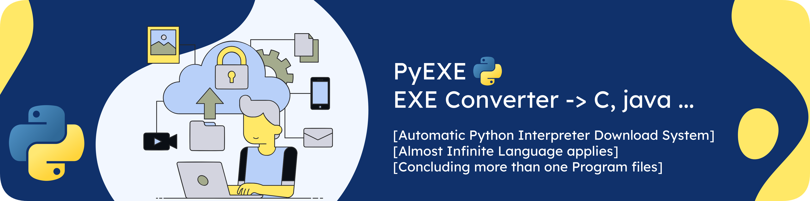
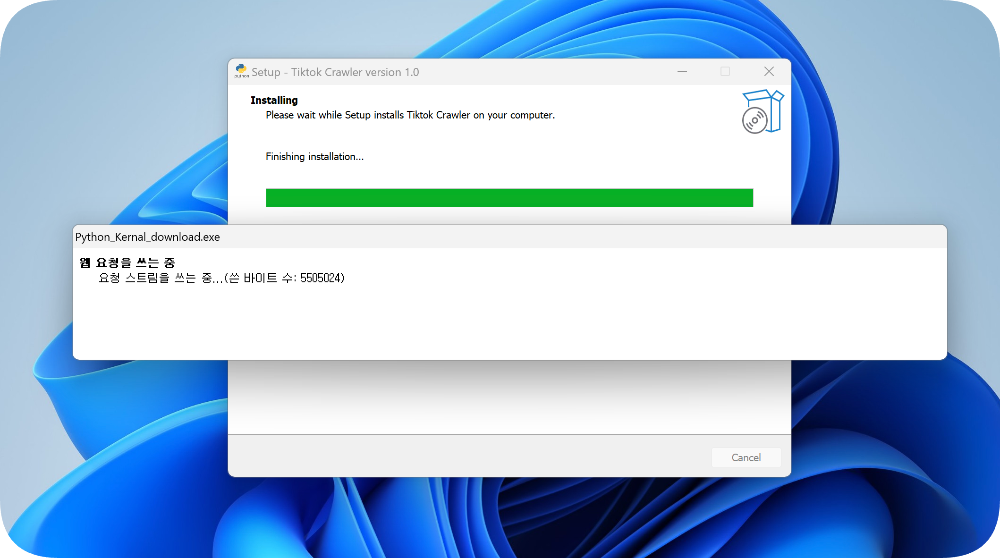
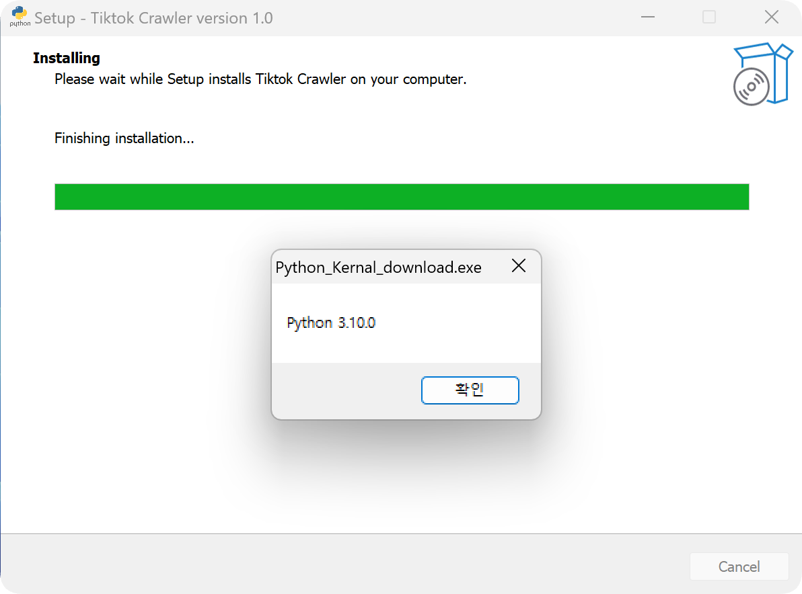
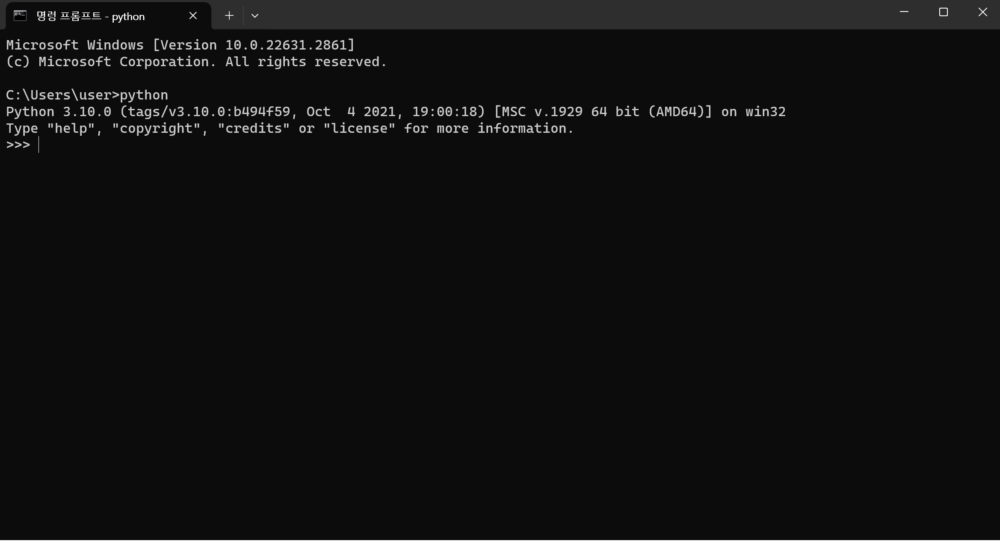

 
Finally, a program has been developed that can automatically download the Python interpreter. (Powershell code)  This program was created to complement the problem previously developed .py to exe. Previously python converting Program that only supports converting, obviously it was hard to publishment python program to non-programer. To support this problem, I add function, "Auto Python Interpreter Download".   This function Downloads Python Interpreter automatically also sets environment variables. After process finishes, your python files are located to Program Files (x86), can be search by Windows Search Engine. Lastely, PyEXE supports Non-Limited program files. If files are connected by import or subprocess, you can select all files to process together in program.

<h3>Every Program must be started with main.py or main.pyw (.c extension is exception. Please check to read Document(README.md) along)</h3>

<h3>As you own Usage, if your program is Non-Console, choosing GUI option, you are able to create GUI program.</h3>

main.py to main.c connection way -> if your python code uses C languages, you should use "ctypes" module

    import ctypes

    function = ctypes.CDLL('./main.dll')
    fuction.main()

"function.main()" -> main should be inner function in C file. After you complete writing you should Compile C file to make Share Library

    
    gcc -shared -o main.dll main.c
    gcc -shared -mwindows -o main.dll main.c

To find more information about gcc compiler, "https://gcc.gnu.org/onlinedocs/"

Module Packaging Method -> module name should be located between [' ']

    import subprocess

    packages = ['']
    for package in packages:
        try:
            subprocess.run(['C:\Program Files\Python310\Scripts\pip.exe', 'install', package, '-q'], stdout=subprocess.DEVNULL, stderr=subprocess.DEVNULL)
        except:
            subprocess.run(['pip', 'install', package, '-q'], stdout=subprocess.DEVNULL, stderr=subprocess.DEVNULL)

<h3>Step for Packaging -> Every amount more than one "!!should be distinguished by 1 space!!"</h3>

Converting your Python file(.py) to EXE file.

1. Choose your icon file(!extension name must be .ico! + !file name must be icon.ico!) locate to asset Directory
2. Process create.exe file wait til Terminal(Command Prompt) appears.
3. Choose 1 if your program is using Console, while choose 2 if your program uses Non-Conseole(GUI Application).
4. Select your language -> Korean/English(If you are korean user, you can also type -> "한국어 or 영어")
5. Type your program language usage amount
6. Type extension name of program (".py", ".c", ".c++", ".c#", ".java" ...)
7. Type your Application name
8. Type your Application version
9. Type Copywriter name
10. Type Copywriter site (You can skip just typing ENTER)
11. Type your all program file name including extension name -> !file must be located in "./module" Directory!
12. Wait til EXE file create completely

 

The following is the content translated into Korean from the description above

 

드디어, 자동으로 Python 인터프리터를 다운로드할 수 있는 프로그램이 개발되었습니다. (PowerShell 코드)  이 프로그램은 이전에 개발된 .py를 .exe로 변환하는 문제를 보완하기 위해 만들어졌습니다. 이전에는 Python 변환 프로그램이 변환만 지원하는데, 이는 비프로그래머들에게 Python 프로그램을 배포하기 어려웠습니다. 이 문제를 해결하기 위해 "자동 Python 인터프리터 다운로드" 기능을 추가했습니다.   이 기능은 Python 인터프리터를 자동으로 다운로드하고 환경 변수를 설정합니다. 프로세스가 완료되면 Python 파일이 Program Files (x86)에 위치하게 되며, Windows 검색 엔진에서 검색할 수 있습니다. 마지막으로, PyEXE는 파일 개수에 제한이 없는 변환을 지원합니다. 파일이 import 또는 subprocess로 연결된 경우 프로그램에서 함께 처리할 모든 파일을 선택할 수 있습니다.

<h3>모든 프로그램은 main.py 혹은 main.pyw 파일로 프로세스가 시작되어야 하며, 이외의 경우는 컴파일이 불가능합니다. (단, .c 는 예외 아래 참조 요망)</h3>

<h3> 사용 방법에 따라, 프로그램이 콘솔을 필요로 하지 않을 경우, 사용자를 위한 GUI 버전 제작 옵션을 선택하십시오.</h3>

main.py에서 main.c로의 연결 방법 -> 프로그램의 Python 코드중 C 언어를 필요로 한다면, "ctypes" 모듈을 사용해야 합니다.

    
    import ctypes

    function = ctypes.CDLL('./main.dll')
    function.main()

"function.main()" -> main은 C 파일 내의 내부 함수여야 합니다. 작성을 완료한 후 C 파일을 컴파일하여 공유 라이브러리를 만들어야 합니다.

    gcc -shared -o main.dl◊l main.c
    gcc -shared -mwindows -o main.dll main.c

gcc 컴파일러에 대한 자세한 정보는 "https://gcc.gnu.org/onlinedocs/"에서 확인할 수 있습니다.>

모듈 패키징 방법 -> 모듈 이름은 [' '] 사이에 위치해야 합니다.

    import subprocess

    packages = ['']
    for package in packages:
        try:
            subprocess.run(['C:\Program Files\Python310\Scripts\pip.exe', 'install', package, '-q'], stdout=subprocess.DEVNULL, stderr=subprocess.DEVNULL)
        except:
            subprocess.run(['pip', 'install', package, '-q'], stdout=subprocess.DEVNULL, stderr=subprocess.DEVNULL)

<h3>패키징 단계 -> 1개 이상의 "!!프로그램 명을 작성할 경우, 띄어쓰기 한칸으로 구분되어야 합니다!!"</h3>

Python 파일(.py)을 EXE 파일로 변환하는 방법.

1. 아이콘 파일을 선택하세요(확장자 이름은 .ico여야 하며 파일 이름은 icon.ico여야 합니다!) - "asset" 디렉토리 내부에 위치
2. create.exe 파일을 실행, 터미널(명령 프롬프트)이 나타날 때까지 기다립니다
3. 프로그램이 콘솔창을 이용한 실행물이라면, 1번 GUI 요소를 활용하여 제작하였다면 2번을 선택하여 주세요
4. 언어를 선택하세요 -> 한국어/영어(한국어 사용자라면 "한국어" 또는 "영어"를 입력할 수도 있습니다.)
5. 프로그램 언어의 개수를 입력하세요
6. 프로그램의 확장자 이름을 입력하세요 (".py", ".c", ".c++", ".c#", ".java"...)
7. 애플리케이션 버전을 입력하세요
8. 저작권자 이름을 입력하세요
9. 저작권자 사이트를 입력하세요 (입력하지 않으려면 ENTER를 누르세요)
10. 확장자 이름을 포함한 모든 프로그램 파일 이름을 입력하세요 -> !파일은 "./module" 디렉토리에 위치해야 합니다!
11. EXE 파일이 완전히 생성될 때까지 기다립니다

DIRECTORY

    .
    ├── asset
    │   └── icon.ico
    ├── module
    │   └── Your convertable file
    ├── Output
    │   └── "Your personal file name".exe
    ├── README_image
    │   ├── Banner.png
    │   ├── install_complete.png
    │   ├── install_ques.png
    │   ├── installing.png
    │   └── testing.png
    ├── create.py
    ├── .gitignore
    └── README.md

<h3>Results Process</h3>

 
This step involves downloading the Python interpreter and setting environment variables using Powershell.

---

This step involves downloading the Python interpreter and setting environment variables using Powershell.

---

 
Finally, we can see alert window saying installed version of python.

---

 
Testing python command in Command Prompt.

